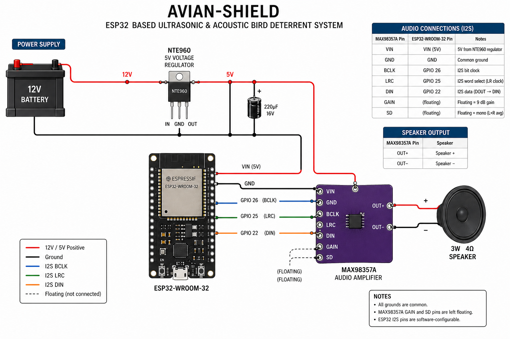

# avian-shield


An ESP32-based ultrasonic and acoustic bird deterrent system. avian-shield uses randomized cycles of predator calls (hawk, owl, and cat) to protect fruit trees and balconies without the need for harmful chemicals or physical barriers.


# Hardware
Components 
- ESP32-WROOM-32: CPU controller board 
- MAX98357A: Audio amplifier 
- LM2596: Step-down (buck) switching voltage regulator
- NTE960: 5V voltage regulator
- [3 Watt 4 Ohm Speaker](https://www.amazon.com/dp/B0822Z4LPH)


# Power supply harness    
- Power source: 12V Battery 
- 5V supply regulator MAX98357A OR NTE960 
- 220uF Capacitor at the output of regulator

# Audio connections
The MAX98357A uses I2S (Inter-IC Sound) protocol. All I2S pins on the ESP32 are software-configurable.

| MAX98357A Pin | ESP32-WROOM-32 Pin | Notes |
|---------------|--------------------|-------|
| VIN           | VIN                | 5V from NTE960 regulator |
| GND           | GND                | Common ground |
| BCLK          | GPIO 26            | I2S bit clock |
| LRC           | GPIO 25            | I2S word select (left/right clock) |
| DIN           | GPIO 22            | I2S data (ESP32 DOUT → amp DIN) |
| GAIN          | (floating)         | Floating = 9 dB gain |
| SD            | (floating)         | Floating = mono (L+R averaged) |

**Speaker output**

| MAX98357A Pin | Speaker |
|---------------|---------|
| OUT+          | Speaker + |
| OUT−          | Speaker − |


# IDE 
For this project we used VS Code + PlatformIO and Claude code integration.

# Building and Flashing the Firmware

## Prerequisites
- [VS Code](https://code.visualstudio.com/) with the [PlatformIO IDE extension](https://platformio.org/install/ide?install=vscode)
- ESP32 board connected via USB

## Project layout

```
avian-shield/          ← this git repo (source of truth)
  firmware/
    avian-shield.cpp   ← main firmware source
  media/
    bobcat.wav
    hawk.wav
    owl.wav

~/Documents/PlatformIO/Projects/avian-shield/   ← PlatformIO build project
  src/main.cpp         ← copy of firmware/avian-shield.cpp
  data/                ← WAV files for embedding
  platformio.ini
```

## One-time setup

1. **Copy the WAV files** from `media/` into the PlatformIO project's `data/` directory:

   ```bash
   mkdir -p ~/Documents/PlatformIO/Projects/avian-shield/data
   cp media/bobcat.wav media/hawk.wav media/owl.wav \
      ~/Documents/PlatformIO/Projects/avian-shield/data/
   ```

2. Confirm `platformio.ini` contains the following (already committed):

   ```ini
   board_build.partitions = huge_app.csv
   board_build.embed_files =
       data/bobcat.wav
       data/hawk.wav
       data/owl.wav
   ```

   > The `huge_app` partition scheme is required because the three WAV files
   > (~1.1 MB of audio) exceed the default 1.25 MB app partition. It allocates
   > 3 MB for the application, of which the firmware uses ~46%.

## Build and upload

### Option A — VS Code + PlatformIO UI

1. Open the PlatformIO project folder in VS Code:
   **File → Open Folder** → `~/Documents/PlatformIO/Projects/avian-shield`

2. Connect the ESP32 via USB.

3. Click **"Build"** (checkmark ✓) in the PlatformIO toolbar at the bottom of the VS Code window to compile. Wait for `[SUCCESS]` in the terminal panel.

4. Click **"Upload"** (right-arrow →) in the same toolbar to flash the board. PlatformIO auto-detects the serial port and resets the board when done.

5. Click **"Serial Monitor"** (plug icon) to open the serial monitor at 115200 baud and verify output.

> All three toolbar buttons are also available via the PlatformIO sidebar icon on the left — expand **esp32doit-devkit-v1 → General**.

### Option B — Terminal

```bash
cd ~/Documents/PlatformIO/Projects/avian-shield

# Build only
~/.platformio/penv/bin/pio run

# Build and upload
~/.platformio/penv/bin/pio run --target upload

# Serial monitor
~/.platformio/penv/bin/pio device monitor --baud 115200
```

PlatformIO will:
1. Embed `data/bobcat.wav`, `data/hawk.wav`, and `data/owl.wav` directly into the binary as read-only flash symbols
2. Compile and link the firmware (~1.45 MB total)
3. Auto-detect the ESP32 on the serial port and flash it at 460800 baud
4. Hard-reset the board — the firmware starts running immediately

## Monitor serial output

Expected output:
```
Avian Shield v1.0
>> bobcat (440744 bytes)
>> owl (353448 bytes)
>> hawk (368808 bytes)
...
```